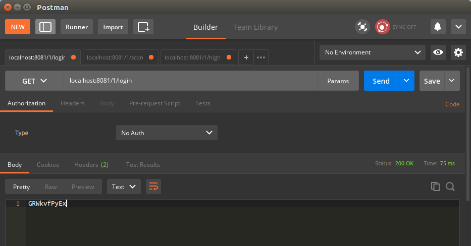
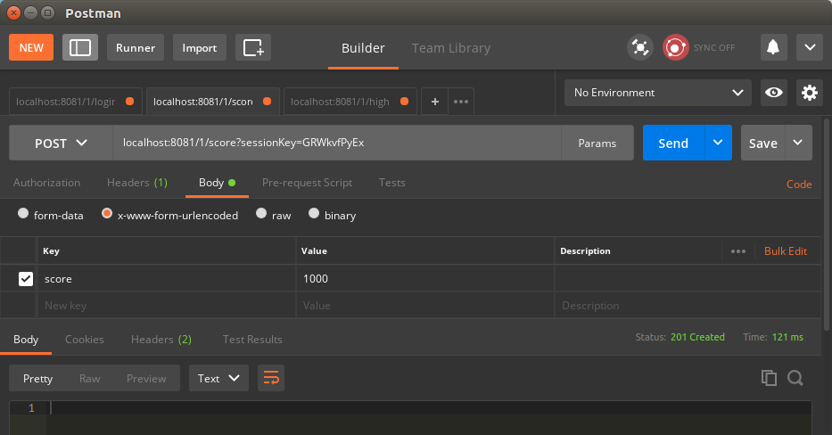
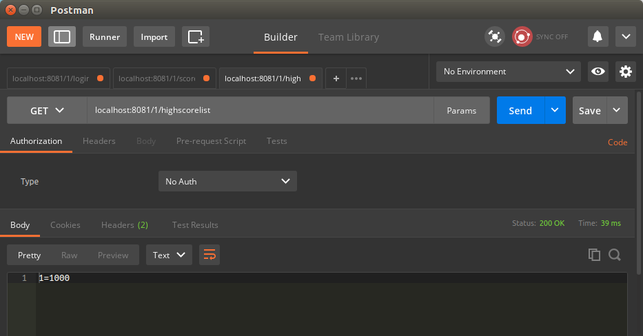
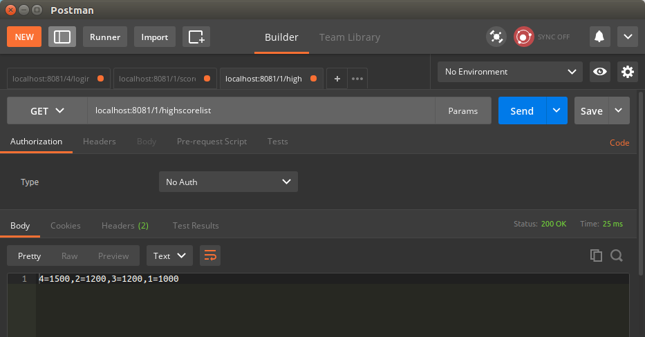

image:https://travis-ci.org/wagnerjfr/game-scores-http-server.svg?branch=master[Build Status,link=https://travis-ci.org/wagnerjfr/game-scores-http-server]
image:https://codecov.io/gh/wagnerjfr/game-scores-http-server/branch/master/graph/badge.svg?token=WBGU823M4L[Build Status,link=https://codecov.io/gh/wagnerjfr/game-scores-http-server]

= Game Scores Register (HTTP Server)
HTTP-based mini game back-end in Java which registers game scores for different users and levels, with the capability to return high score lists per level.

== 1. Technologies used to develop

- https://java.com/en/download/faq/java8.xml[*Java 8*]
- https://maven.apache.org/[*Maven*]
- https://junit.org/junit5/docs/current/user-guide/[*JUnit 5.6.2*]
- https://www.jetbrains.com/idea/[*IntelliJ*]
- https://docs.oracle.com/javase/8/docs/jre/api/net/httpserver/spec/com/sun/net/httpserver/HttpServer.html[*HTTP*] (com.sun.net.httpserver.HttpServer)
- https://www.postman.com/[*Postman*]

== 2. How to start the server

Clone and build the project:
----
$ git clone https://github.com/wagnerjfr/game-scores-http-server.git

$ cd game-scores-http-server

$ mvn clean package
----

The HTTP server can be launched in terminal by running:
----
$ java -jar target/game-scores-0.0.1.jar
----

Output:
----
computer:~/game-scores-http-server/$ java -jar target/game-scores-0.0.1.jar

WebServerHttp is listening on port 8081

----

As displayed above, the server uses the port *8081*.

== 3. How to register scores

All the steps below will be using Postman.

=== 3.1. Login

[source, shell]
----
Request: GET /<userid>/login

Response: <sessionkey>

<userid>     : 31 bit unsigned integer number
<sessionkey> : A string representing session (valid for 10 minutes).
----

Example:

Let's create a session key for user with id equals to *1*.

Select **GET** request type, add the http address `localhost:8081/1/login` and click the *Send* button (see image below).

The user with id *1* has now a session key with value *GRWkvfPyEx*.

The status of the request is *200 OK* as shown in the right-middle of the figure.

=== 3.2. Post a user's score to a level

----
Request: POST /<levelid>/score?sessionkey=<sessionkey>

Request body: <score>

Response: (nothing)

<levelid>    : 31 bit unsigned integer number
<sessionkey> : A session key string retrieved from the login function.
<score>      : 31 bit unsigned integer number
----

Example:

Copy and paste the session key create in the section before and let's register the score *1000* points to level id *1*.

Select the *POST* request type and add the http address like:

`localhost:8081/1/score?sessionKey=GRWkvfPyEx`

In the *Body* part of the request, also add a key/value pair:
`Key: score; Value: 1000` as shown in the image below, and hit *Send*:

The status is *201 Create* as shown in the right-middle of the figure above.

=== 3.3. Get a high score list for a level

----
Request: GET /<levelid>/highscorelist

Response: CSV of <userid>=<score>

<levelid> : 31 bit unsigned integer number
<score>   : 31 bit unsigned integer number
<userid>  : 31 bit unsigned integer number
----

Example:

To list the high scores from a game level, in this example level id *1*.

Select **GET** request type, add the http address `localhost:8081/1/highscorelist` and click the *Send* button.

The status is *200 OK* as shown in the right-middle of the figure above.

After adding more 3 new user's scores (user ids: 2, 3 and 4) for the same game level.

Just repeat the steps again posting more points for the same user, posting points to different game levels, getting session key to new users and etc.